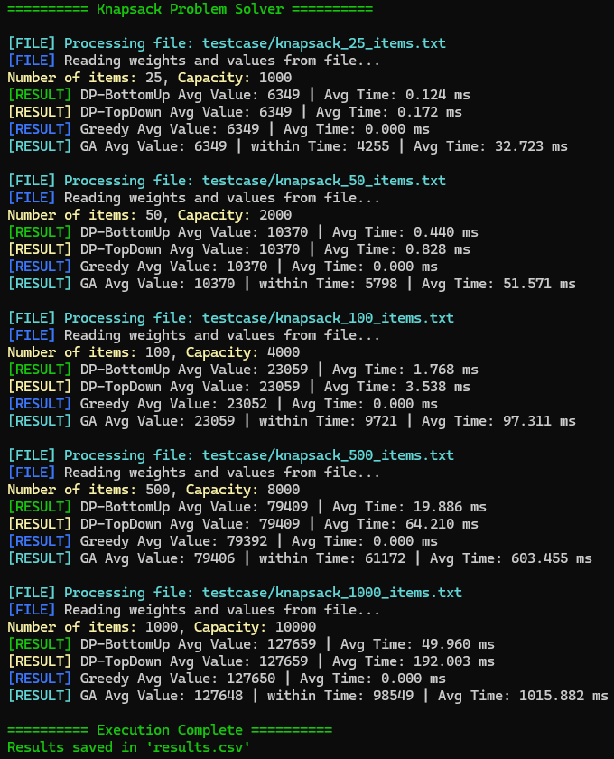

---

# 🎒 **Knapsack Problem Solver**

---

## 🏫 **About This Project**

Welcome to the **Knapsack Problem Solver** repository! This project serves as my final submission for the **CPE231 - Algorithm Class** course in **Computer Engineering**, **King Mongkut's University of Technology Thonburi (KMUTT)**.

This project aims to explore and implement multiple algorithms to solve the **Knapsack Problem**, a classic optimization problem, using the following approaches:

- **Brute Force Approach** 🚀
- **Dynamic Programming (Bottom-Up & Top-Down)** 💻
- **Genetic Algorithm** 🧬

---

## 📚 **Objective**

The purpose of this project is to:

✅ Compare different methods of solving the knapsack problem.  
✅ Implement multiple problem-solving strategies in C.  
✅ Evaluate and analyze performance across multiple scenarios.  

---

## 💡 **What is the Knapsack Problem?**

The **Knapsack Problem** is a combinatorial optimization problem. Given a set of items, each with a weight and value, and a maximum weight capacity, the goal is to determine the optimal subset of these items to maximize the total value without exceeding the weight limit.

---

## ⚙️ **Algorithms Implemented**

### 1️⃣ **Brute Force Approach**
   - Explores all possible combinations of items using bit manipulation.
   - Finds the optimal subset by evaluating every possible combination.
   - Computationally expensive for large inputs but provides a simple brute-force solution.

---

### 2️⃣ **Dynamic Programming**
   - Bottom-Up DP 🏆:
     Iteratively builds a table from base cases to solve the problem without recursion.
   - Top-Down DP 📉:
     Utilizes recursion and memoization to solve overlapping subproblems efficiently.

---

### 3️⃣ **Genetic Algorithm**
   - Simulates the principles of evolution (selection, mutation, crossover) to find an optimal or near-optimal solution.
   - Uses population-based search methods to explore the solution space.

---

## 🛠️ **Tech Stack**

- **Programming Language:** C  
- **Tools:** GCC for compilation  
- **Development Environment:** Visual Studio Code

---

## 🚀 **Getting Started**

Follow the instructions below to run the project on your local machine.

### 1. Clone the Repository

```bash
git clone https://github.com/yourusername/knapsack-problem.git
cd knapsack-problem
```

---

### 2. Compile the Source Code

You can compile the source code using `gcc`. For example:

```bash
gcc gcc main.c -o main.exe
```

---

### 3. Run the Program

After compilation, run the executable:

```bash
main.exe
```

Follow the prompts to enter the number of items, their weights, values, and total weight capacity.

---

## 🏆 **Features**

✅ Multiple Knapsack Problem-solving strategies:  
- Brute Force, Dynamic Programming (Bottom-Up & Top-Down), and Genetic Algorithm.

---

## 💬 **Screenshots**

**

---

## 🙏 **Acknowledgements**

This project would not be possible without the foundational knowledge and inspiration gained from studying **CPE231 - Algorithms** and guidance from my professors and peers at **KMUTT**.

---

📧 **Contact Us:**  
| [GitHub Profile](https://github.com/Muaykillz)
| [GitHub Profile](https://github.com/NongChugra)
| [GitHub Profile](https://github.com/HOOd-00)
| [GitHub Profile](https://github.com/Feen0305)
| [GitHub Profile](https://github.com/DarkTouiZ)

---